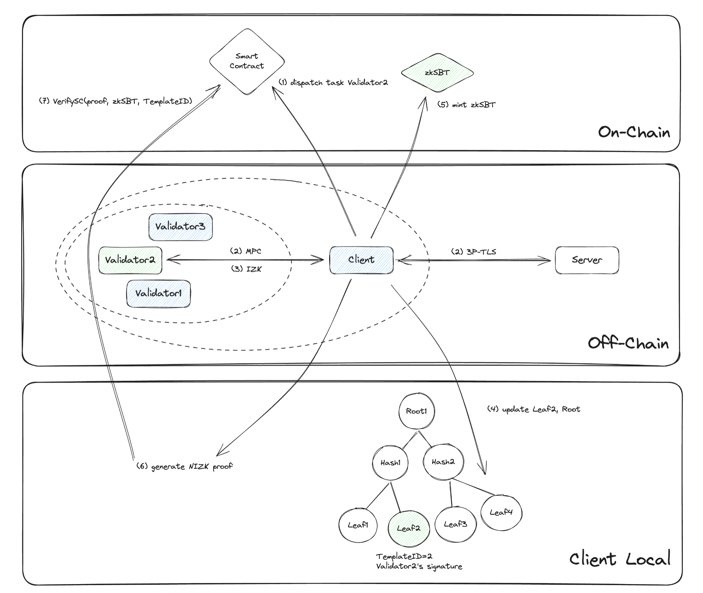
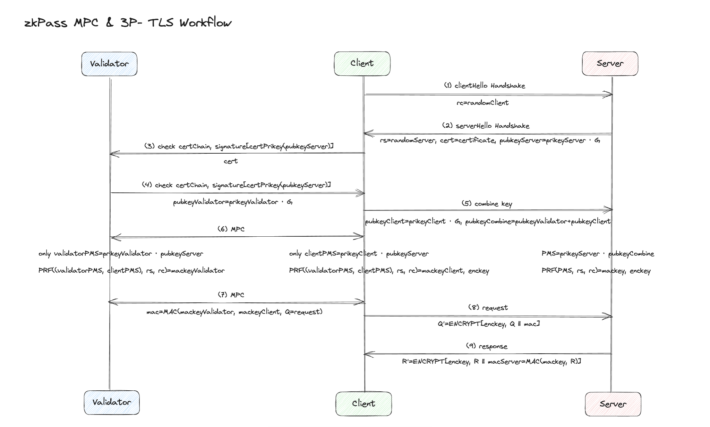
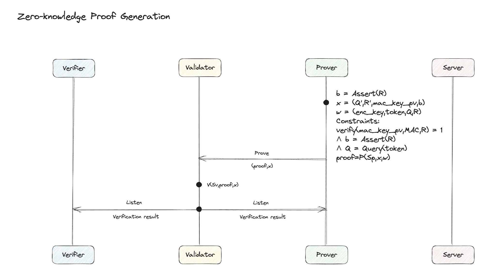
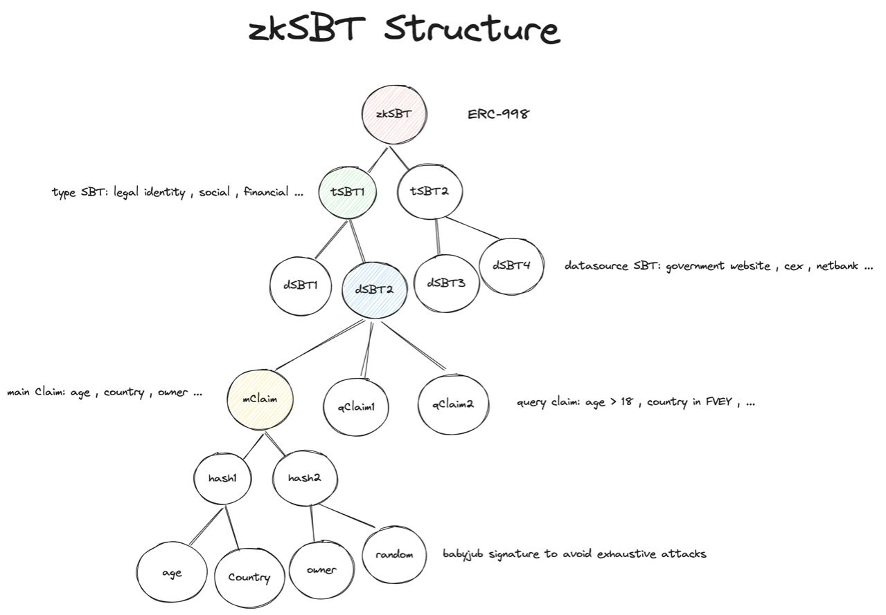

# Overall

zkPass primarily employs technologies such as Three-Party TLS (3P-TLS), Multi-party Secure Computation (MPC), and Zero-Knowledge Proof (ZKP). These technologies enable provers to convert any private data from HTTPS websites into zk proofs. At the same time, they ensure privacy protection and prevent data forgery by malicious users.

  

# 3P-TLS and MPC

  

In the 3P-TLS protocol, there are three key players: **_S_**, who serves as a trusted data source, **_P_**, the Prover/user, and **_V_**, the zkPass node. P and V collaborate as a client to establish secure communication with S through a series of stages.

**Stage 1: Three-Party Handshake**

The first stage involves a three-party handshake protocol. Here, P, V, and S collectively generate session keys. P and V each obtain a share of these keys. This is achieved using the Paillier encryption algorithm, which offers additive homomorphism. The pre-master key is divided into two parts, with P and V receiving one-half each, while S retains the complete pre-master key. Importantly, to prevent the client from forging fake websites, after the Client and Server exchange greetings, the Client will ask the Server to return the certificate. The subsequent key exchange phase also includes the server’s public key signature, which is signed by the private key of the certificate. This allows V within the Client to also obtain the certificate and signature for verification, ensuring trust in the data source.

**Stage 2: Key Exchange and MPC**

In steps 6 and 7, P and V engage in MPC to compute the encryption key (enc_key) for data protection and the message authentication code key (mac_key) for data integrity. It’s essential to note that V only possesses a share of the mac_key and no enc_key. This ensures that V cannot access the user’s private information. In contrast, P holds a share of the mac_key, granting access to specific identity information without the ability to tamper with it. Any tampering can be detected by verifying message authenticity using the mac_key.

**Stage 3: Standard TLS and Zero-Knowledge Proofs Preparation**

Steps 8 and 9 follow standard TLS protocol procedures for application data. In steps 10 to 12, P and V exchange keys in preparation for an upcoming phase involving zero-knowledge proofs.

At this point, the three-party TLS protocol concludes. The MPC algorithm of zkPass has undergone significant optimization in terms of communication time, hash functions for Garbler, Evaluator, and OT, as well as memory copying operations. This has resulted in an efficiency improvement of over threefold. Additionally, a new AES128 proof method has been adopted, which has reduced the number of blocks by 300 times and improved Garbler/Evaluator execution time tenfold. Specifically, zkPass employs Silent OT for OT operations, effectively reducing offline network communication during OT generation. In terms of Garbled Circuits, zkPass utilizes Stacked GC, which significantly reduces the size of Garbled Circuits, thereby decreasing online communication and execution time. This overall optimization has substantially reduced the runtime of the entire MPC process.

# ZKP

  

The final step of the zkPass protocol involves the client generating zero-knowledge proof, which the smart contract on the blockchain verifies. We employ a Hybrid Zero-Knowledge (ZK) approach combining interactive and non-interactive ZK protocols.

**Interactive Zero-Knowledge (IZK):**

We utilize a VOLE-based interactive Zero-Knowledge (ZK) protocol, which we refer to as VOLE-ZK 23. This protocol plays a crucial role in authentication, ensuring the data's origin from the precise data source and safeguarding it against client tampering. The VOLE-ZK 23 protocol can be described as a "commit and prove" framework. In this setup, both the Prover (P) and the Verifier (V) jointly generate numerous VOLE instances, each satisfying a linear formula denoted as "m = k + w \* delta." P holds certain components of this formula as a commitment, with 'm' serving as the commitment, and 'w' can be converted into a witness after derandomization.

On the other hand, V holds the remaining components ('k' and 'delta'). The objective is to prove and verify the satisfaction of a boolean circuit. P establishes a commitment for every gate based on the VOLE instance. Since the correlation between VOLE instances is linear, we can batch-check the results by summing up all commitments and confirming whether the final result still adheres to the correlation. This linearity is a key reason our solution is cost-effective, setting it apart from other high-degree polynomial solutions like SNARK.

Consequently, P only needs to transmit two field elements (the sum of 'm' and the sum of 'w') to the Verifier. To protect sensitive information, a random linear combination can be created. V then validates the correlation using its VOLE parameters ('k' and 'delta').

There are five main constraints at this stage:

**The vector x = (Q', R', mac_key_pv, b) represents the public signal, and w = (enc_key, token, Q, R) is the witness.**

**Dec(enc_key, Q') = Q, and Q = Query(token)**

The first two constraints are related to the HTTP requests made to the trusted data source. The first constraint ensures that the request is encrypted using the encryption key. The second constraint specifies that the request must be generated using the user's access token, typically stored in cookies in most cases. These two constraints confirm that the user uses their personal data (such as a username and password) and follows a specific API defined in the template.

**Dec(enc_key, R‘) = R**

R' represents the response received from the trusted data source and is encrypted using the encryption key. Therefore, this constraint implies that the user must possess the encryption key generated during a three-party handshake to decrypt the response. This constraint ensures that the user cannot create a counterfeit encryption key.

**Verify(mac_key_pv, MAC, R) = 1**

R stands for the decrypted response. The zkPass protocol must ensure that this response (R) remains unaltered by the user. To substantiate this, the constraint is applied. The additional MAC (Message Authentication Code) data attached to the end of R is generated using the MAC key. The verification process employs HMAC with the SHA256 hash function. This verification step serves as a safeguard against any unauthorized modifications to the response data by the user.

**b = Assert(R)**

The final constraint signifies that the data contained within R must adhere to specific conditions outlined in the template. For instance, if R is structured as a JSON object like {user: xxx, age: 30}, it necessitates that the "age" property must have a value greater than 18. In simpler terms, this constraint ensures that the data inside R complies with predetermined criteria.

## Optimization

VOLE instances and commitments for all gates. In zkPass, we've undertaken several optimizations to enhance the protocol's practicality. We've introduced SoftSpoken, which effectively reduces network overhead by approximately 50% and accelerates VOLE generation. Leveraging the additive homomorphic properties of the VOLE, we've managed to minimize commitments for XOR and INV gates to zero. We've demonstrated that, in practice, only commitments for AND gates are necessary for security. This reduction has significantly streamlined the circuit's complexity, with a predominant focus on AND gates, which are considerably smaller compared to the original setup.

Furthermore, for our specific use case involving identical operations such as AES encryption and decryption in server record processing, we can reuse VOLE parameters. This further reduces network traffic by transforming multiplicative operations into additive ones. We refer to this as "signal input for multi-data," akin to SIMD (Single Instruction, Multiple Data) in CPU architecture.

One potential protocol limitation is that the node must remain online during the proof and verification processes. However, this requirement aligns seamlessly with our specific needs, rendering it a non-issue for our project.

# NIZK

Subsequently, we transition from the Interactive Zero-Knowledge (IZK) proof to the Non-Interactive Zero-Knowledge (NIZK) proof. This transformation serves the purpose of concealing the actual template schema, enabling users to selectively reveal the proof for public verification by any party. To achieve this, we employ a SNARK (Succinct Non-Interactive Argument of Knowledge) framework, specifically Circom.

The process is relatively straightforward. Once the client successfully passes the IZK verification, the node provides a signature for the result. Subsequently, the client inserts the result and its associated signature into a Merkle tree and updates the root within the SBT (Selective Blockchain Tree) contract.

When the client needs to prove the result, all that is necessary is to present a zero-knowledge proof demonstrating that the result is a leaf within the Merkle tree and has been signed by the node. This method allows for efficient and secure validation of results while preserving privacy and scalability.

# SBT

  

This diagram illustrates how we construct the zkSBT. We adhere to the ERC998 standard, a composable NFT standard, and build the NFT from the ground up. Notably, the tSBT and dSBT are essentially NFTs in themselves. The tSBT represents categories such as legal identity, social network, and financial information. At the same time, the dSBT contains the actual credentials claimed by the user, such as their digital legal identity from a government website or a bank account. We've customized the dSBT code to store additional information known as "claims."

These claims come in two types: the main claim and the query claim. The main claim involves the user obtaining their private data from a data source, such as country, age, gender, and other information from a government website, after performing a secure multi-party computation (MPC). We construct the claim tree based on this data, with each node representing the hash of its child nodes. To enhance security, we add a random number derived from the private key and the ID of the main claim using a babyjub signature, which helps thwart exhaustive attacks. Subsequently, we store the root hash of the main claim tree in the dSBT. Naturally, a Zero-Knowledge (ZK) proof of the correctness of the tree must be generated and verified by the smart contract.

At this point, we have the main claim. As for the query claim, for instance, determining whether the user's age is greater than 18, the user only needs to provide proof that the leaf representing their age is included in the tree and that the value of this leaf is greater than 18. The user can then directly transmit this proof to the verifier. The verifier can execute an on-chain function to validate the proof.

The overarching structure ensures that the user's actual private data remains concealed from all parties involved. Only the statement of a data query is selectively disclosed to the specific verifier.

# Security

First, let's identify the potential adversaries within the protocol:

From the client's perspective, the primary concern is the risk of bypassing node verification using invalid data. On the other hand, the node's objective may be gaining unauthorized access to the client's private data.

Let's address the latter scenario first. Based on the protocol design, this goal is effectively unattainable for the node.

Now, with regard to the first scenario, given the semi-honest nature of the protocol, as long as all parties adhere to the protocol guidelines, security is upheld, and accurate results are achieved.

The remaining challenge revolves around the interaction between a malicious client and a malicious node. To mitigate the threat posed by a malicious node, we've introduced a gateway that functions in a manner akin to an RPC endpoint within the blockchain. This gateway ensures that the client remains indistinguishable with respect to network information. Furthermore, the introduction of randomness through TLS (Transport Layer Security) further conceals the client based on session data.

In our decentralized network, we've introduced a novel concept known as a "Fisherman," tasked with sending random tasks to nodes. This fisherman effectively identifies and exposes any malicious nodes. Since nodes cannot differentiate between genuine clients and fishermen, any malicious node engaging in malicious activities risks losing its staked assets while the fisherman is rewarded. Consequently, engaging in such behavior is not in the node's best interest.

Clients and fishermen can seek arbitration through an arbitrator who serves as a relay for task execution. The arbitrator can cache all communication data and request that the node disclose its VOLE parameters. This enables the arbitrator to reenact the entire verification process, determining which party is at fault and successfully concluding the arbitration process. Importantly, all these processes are automated and necessitate minimal manual intervention.